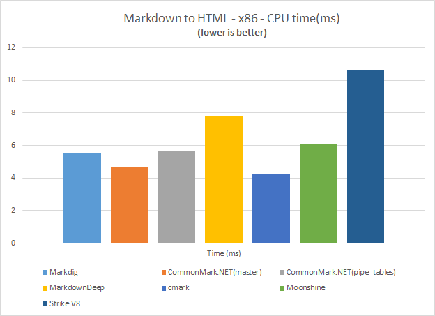
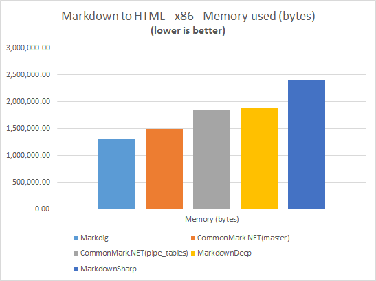

# Markdig [](https://github.com/lunet-io/markdig/actions) [](https://coveralls.io/github/lunet-io/markdig?branch=master) [](https://www.nuget.org/packages/Markdig/) [](https://www.paypal.com/cgi-bin/webscr?cmd=_s-xclick&hosted_button_id=FRGHXBTP442JL)


Markdig is a fast, powerful, [CommonMark](http://commonmark.org/) compliant, extensible Markdown processor for .NET.

> NOTE: The repository is under construction. There will be a dedicated website and proper documentation at some point!

You can **try Markdig online** and compare it to other implementations on [babelmark3](https://babelmark.github.io/?text=Hello+**Markdig**!)

## Features

- **Very fast parser and html renderer** (no-regexp), very lightweight in terms of GC pressure. See benchmarks
- **Abstract Syntax Tree** with precise source code location for syntax tree, useful when building a Markdown editor.
  - Checkout [MarkdownEditor for Visual Studio](https://visualstudiogallery.msdn.microsoft.com/eaab33c3-437b-4918-8354-872dfe5d1bfe) powered by Markdig!
- Converter to **HTML**
- Passing more than **600+ tests** from the latest [CommonMark specs (0.29)](http://spec.commonmark.org/)
- Includes all the core elements of CommonMark:
  - including **GFM fenced code blocks**.  
- **Extensible** architecture
  - Even the core Markdown/CommonMark parsing is pluggable, so it allows to disable builtin Markdown/Commonmark parsing (e.g [Disable HTML parsing](https://github.com/lunet-io/markdig/blob/7964bd0160d4c18e4155127a4c863d61ebd8944a/src/Markdig/MarkdownExtensions.cs#L306)) or change behaviour (e.g change matching `#` of a headers with `@`)   
- Built-in with **20+ extensions**, including:
  - 2 kind of tables:
    - [**Pipe tables**](src/Markdig.Tests/Specs/PipeTableSpecs.md) (inspired from GitHub tables and [PanDoc - Pipe Tables](http://pandoc.org/README.html#extension-pipe_tables))
    - [**Grid tables**](src/Markdig.Tests/Specs/GridTableSpecs.md) (inspired from [Pandoc - Grid Tables](http://pandoc.org/README.html#extension-grid_tables)) 
  - [**Extra emphasis**](src/Markdig.Tests/Specs/EmphasisExtraSpecs.md) (inspired from [Pandoc - Emphasis](http://pandoc.org/README.html#strikeout) and [Markdown-it](https://markdown-it.github.io/)) 
    - strike through `~~`,
    - Subscript `~`
    - Superscript `^` 
    - Inserted `++`
    - Marked `==`
  - [**Special attributes**](src/Markdig.Tests/Specs/GenericAttributesSpecs.md) or attached HTML attributes (inspired from [PHP Markdown Extra - Special Attributes](https://michelf.ca/projects/php-markdown/extra/#spe-attr))
  - [**Definition lists**](src/Markdig.Tests/Specs/DefinitionListSpecs.md) (inspired from [PHP Markdown Extra - Definitions Lists](https://michelf.ca/projects/php-markdown/extra/#def-list))
  - [**Footnotes**](src/Markdig.Tests/Specs/FootnotesSpecs.md) (inspired from [PHP Markdown Extra - Footnotes](https://michelf.ca/projects/php-markdown/extra/#footnotes))
  - [**Auto-identifiers**](src/Markdig.Tests/Specs/AutoIdentifierSpecs.md) for headings (similar to [Pandoc - Auto Identifiers](http://pandoc.org/README.html#extension-auto_identifiers))
  - [**Auto-links**](src/Markdig.Tests/Specs/AutoLinks.md) generates links if a text starts with `http://` or `https://` or `ftp://` or `mailto:` or `www.xxx.yyy`
  - [**Task Lists**](src/Markdig.Tests/Specs/TaskListSpecs.md)  inspired from [Github Task lists](https://github.com/blog/1375-task-lists-in-gfm-issues-pulls-comments).
  - [**Extra bullet lists**](src/Markdig.Tests/Specs/ListExtraSpecs.md), supporting alpha bullet `a.` `b.` and roman bullet (`i`, `ii`...etc.)
  - [**Media support**](src/Markdig.Tests/Specs/MediaSpecs.md) for media url (youtube, vimeo, mp4...etc.) (inspired from this [CommonMark discussion](https://talk.commonmark.org/t/embedded-audio-and-video/441))
  - [**Abbreviations**](src/Markdig.Tests/Specs/AbbreviationSpecs.md) (inspired from [PHP Markdown Extra - Abbreviations](https://michelf.ca/projects/php-markdown/extra/#abbr))
  - [**Citation**](src/Markdig.Tests/Specs/FigureFooterAndCiteSpecs.md) text by enclosing `""...""` (inspired by this [CommonMark discussion ](https://talk.commonmark.org/t/referencing-creative-works-with-cite/892))
  - [**Custom containers**](src/Markdig.Tests/Specs/CustomContainerSpecs.md) similar to fenced code block `:::` for generating a proper `<div>...</div>` instead (inspired by this [CommonMark discussion ](https://talk.commonmark.org/t/custom-container-for-block-and-inline/2051))
  - [**Figures**](src/Markdig.Tests/Specs/FigureFooterAndCiteSpecs.md) (inspired from this [CommonMark discussion](https://talk.commonmark.org/t/image-tag-should-expand-to-figure-when-used-with-title/265/5))
  - [**Footers**](src/Markdig.Tests/Specs/FigureFooterAndCiteSpecs.md) (inspired from this [CommonMark discussion](https://talk.commonmark.org/t/syntax-for-footer/2070))
  - [**Mathematics**](src/Markdig.Tests/Specs/MathSpecs.md)/Latex extension by enclosing `$$` for block and `$` for inline math (inspired from this [CommonMark discussion](https://talk.commonmark.org/t/mathematics-extension/457/31))
  - [**Soft lines as hard lines**](src/Markdig.Tests/Specs/HardlineBreakSpecs.md)
  - [**Emoji**](src/Markdig.Tests/Specs/EmojiSpecs.md) support (inspired from [Markdown-it](https://markdown-it.github.io/))
  - [**SmartyPants**](src/Markdig.Tests/Specs/SmartyPantsSpecs.md) (inspired from [Daring Fireball - SmartyPants](https://daringfireball.net/projects/smartypants/))
  - [**Bootstrap**](src/Markdig.Tests/Specs/BootstrapSpecs.md) class (to output bootstrap class)
  - [**Diagrams**](src/Markdig.Tests/Specs/DiagramsSpecs.md) extension whenever a fenced code block contains a special keyword, it will be converted to a div block with the content as-is (currently, supports [`mermaid`](https://knsv.github.io/mermaid/) and [`nomnoml`](https://github.com/skanaar/nomnoml) diagrams)
  - [**YAML Front Matter**](src/Markdig.Tests/Specs/YamlSpecs.md) to parse without evaluating the front matter and to discard it from the HTML output (typically used for previewing without the front matter in MarkdownEditor)
  - [**JIRA links**](src/Markdig.Tests/Specs/JiraLinks.md) to automatically generate links for JIRA project references (Thanks to @clarkd: https://github.com/clarkd/MarkdigJiraLinker)
- Starting with Markdig version `0.20.0+`, Markdig is compatible only with `NETStandard 2.0`, `NETStandard 2.1`, `NETCoreApp 2.1` and `NETCoreApp 3.1`.

If you are looking for support for an old .NET Framework 3.5 or 4.0, you can download Markdig `0.18.3`.
	
### Third Party Extensions

- [**WPF/XAML Markdown Renderer**: `markdig.wpf`](https://github.com/Kryptos-FR/markdig.wpf)
- [**WPF/XAML Markdown Renderer**: `Neo.Markdig.Xaml`](https://github.com/neolithos/NeoMarkdigXaml)
- [**Syntax highlighting**: `Markdig.SyntaxHighlighting`](https://github.com/RichardSlater/Markdig.SyntaxHighlighting)
- [**Embedded C# scripting**: `Markdig.Extensions.ScriptCs`](https://github.com/macaba/Markdig.Extensions.ScriptCs)

## Documentation

> The repository is under construction. There will be a dedicated website and proper documentation at some point!

While there is not yet a dedicated documentation, you can find from the [specs documentation](src/Markdig.Tests/Specs/readme.md) how to use these extensions.

In the meantime, you can have a "behind the scene" article about Markdig in my blog post ["Implementing a Markdown Engine for .NET"](http://xoofx.com/blog/2016/06/13/implementing-a-markdown-processor-for-dotnet/)

## Download

Markdig is available as a NuGet package: [](https://www.nuget.org/packages/Markdig/)

Also [Markdig.Signed](https://www.nuget.org/packages/Markdig.Signed/) NuGet package provides signed assemblies.

## Usage

The main entry point for the API is the `Markdig.Markdown` class:

By default, without any options, Markdig is using the plain CommonMark parser:

```csharp
var result = Markdown.ToHtml("This is a text with some *emphasis*");
Console.WriteLine(result);   // prints: <p>This is a text with some <em>emphasis</em></p>
```

In order to activate most of all advanced extensions (except Emoji, SoftLine as HardLine, Bootstrap, YAML Front Matter, JiraLinks and SmartyPants)

```csharp
// Configure the pipeline with all advanced extensions active
var pipeline = new MarkdownPipelineBuilder().UseAdvancedExtensions().Build();
var result = Markdown.ToHtml("This is a text with some *emphasis*", pipeline);
```

You can have a look at the [MarkdownExtensions](https://github.com/lunet-io/markdig/blob/master/src/Markdig/MarkdownExtensions.cs) that describes all actionable extensions (by modifying the MarkdownPipeline)

## Build

In order to build Markdig, you need to install [.NET Core RTM](https://www.microsoft.com/net/core)

## License

This software is released under the [BSD-Clause 2 license](https://github.com/lunet-io/markdig/blob/master/license.txt).


## Benchmarking

This is an early preview of the benchmarking against various implementations:

**C implementations**:

- [cmark](https://github.com/jgm/cmark) (version: 0.25.0): Reference C implementation of CommonMark, no support for extensions
- [Moonshine](https://github.com/brandonc/moonshine) (version: : popular C Markdown processor

**.NET implementations**:

- [Markdig](https://github.com/lunet-io/markdig) (version: 0.5.x): itself
- [CommonMark.NET(master)](https://github.com/Knagis/CommonMark.NET) (version: 0.11.0): CommonMark implementation for .NET, no support for extensions, port of cmark
  - [CommonMark.NET(pipe_tables)](https://github.com/AMDL/CommonMark.NET/tree/pipe-tables): An evolution of CommonMark.NET, supports extensions, not released yet
- [MarkdownDeep](https://github.com/toptensoftware/markdowndeep) (version: 1.5.0): another .NET implementation
- [MarkdownSharp](https://github.com/Kiri-rin/markdownsharp) (version: 1.13.0): Open source C# implementation of Markdown processor, as featured on Stack Overflow, regexp based.
- [Marked.NET](https://github.com/T-Alex/MarkedNet) (version: 1.0.5) port of original [marked.js](https://github.com/chjj/marked) project
- [Microsoft.DocAsCode.MarkdownLite](https://github.com/dotnet/docfx/tree/dev/src/Microsoft.DocAsCode.MarkdownLite) (version: 2.0.1) used by the [docfx](https://github.com/dotnet/docfx) project

**JavaScript/V8 implementations**:

- [Strike.V8](https://github.com/SimonCropp/Strike) (version: 1.5.0)  [marked.js](https://github.com/chjj/marked) running in Google V8 (not .NET based)

### Analysis of the results:

- Markdig is roughly **x100 times faster than MarkdownSharp**, **30x times faster than docfx**
- **Among the best in CPU**, Extremely competitive and often faster than other implementations (not feature wise equivalent) 
- **15% to 30% less allocations** and GC pressure

Because Marked.NET,  MarkdownSharp and DocAsCode.MarkdownLite are way too slow, they are not included in the following charts:






### Performance for x86:

```
BenchmarkDotNet-Dev=v0.9.7.0+
OS=Microsoft Windows NT 6.2.9200.0
Processor=Intel(R) Core(TM) i7-4770 CPU 3.40GHz, ProcessorCount=8
Frequency=3319351 ticks, Resolution=301.2637 ns, Timer=TSC
HostCLR=MS.NET 4.0.30319.42000, Arch=32-bit RELEASE
JitModules=clrjit-v4.6.1080.0

Type=Program  Mode=SingleRun  LaunchCount=2
WarmupCount=2  TargetCount=10

                     Method |      Median |    StdDev |Scaled |  Gen 0 | Gen 1|    Gen 2|Bytes Allocated/Op |
--------------------------- |------------ |---------- |------ | ------ |------|---------|------------------ |
                    Markdig |   5.5316 ms | 0.0372 ms |  0.71 |   56.00| 21.00|    49.00|      1,285,917.31 |
     CommonMark.NET(master) |   4.7035 ms | 0.0422 ms |  0.60 |  113.00|  7.00|    49.00|      1,502,404.60 |
CommonMark.NET(pipe_tables) |   5.6164 ms | 0.0298 ms |  0.72 |  111.00| 56.00|    49.00|      1,863,128.13 |
               MarkdownDeep |   7.8193 ms | 0.0334 ms |  1.00 |  120.00| 56.00|    49.00|      1,884,854.85 |
                      cmark |   4.2698 ms | 0.1526 ms |  0.55 |       -|     -|        -|                NA |
                  Moonshine |   6.0929 ms | 0.1053 ms |  1.28 |       -|     -|        -|                NA |
                  Strike.V8 |  10.5895 ms | 0.0492 ms |  1.35 |       -|     -|        -|                NA |
                 Marked.NET | 207.3169 ms | 5.2628 ms | 26.51 |    0.00|  0.00|     0.00|    303,125,228.65 |
              MarkdownSharp | 675.0185 ms | 2.8447 ms | 86.32 |   40.00| 27.00|    41.00|      2,413,394.17 |
Microsoft DocfxMarkdownLite | 166.3357 ms | 0.4529 ms | 21.27 |4,452.00|948.00|11,167.00|    180,218,359.60 |
```

### Performance for x64:

```
BenchmarkDotNet-Dev=v0.9.6.0+
OS=Microsoft Windows NT 6.2.9200.0
Processor=Intel(R) Core(TM) i7-4770 CPU @ 3.40GHz, ProcessorCount=8
Frequency=3319351 ticks, Resolution=301.2637 ns, Timer=TSC
HostCLR=MS.NET 4.0.30319.42000, Arch=64-bit RELEASE [RyuJIT]
JitModules=clrjit-v4.6.1080.0

Type=Program  Mode=SingleRun  LaunchCount=2
WarmupCount=2  TargetCount=10

               Method |    Median |    StdDev |  Gen 0 |  Gen 1 | Gen 2 | Bytes Allocated/Op |
--------------------- |---------- |---------- |------- |------- |------ |------------------- |
          TestMarkdig | 5.5276 ms | 0.0402 ms | 109.00 |  96.00 | 84.00 |       1,537,027.66 |
    TestCommonMarkNet | 4.4661 ms | 0.1190 ms | 157.00 |  96.00 | 84.00 |       1,747,432.06 |
 TestCommonMarkNetNew | 5.3151 ms | 0.0815 ms | 229.00 | 168.00 | 84.00 |       2,323,922.97 |
     TestMarkdownDeep | 7.4076 ms | 0.0617 ms | 318.00 | 186.00 | 84.00 |       2,576,728.69 |
```

## Donate

If you are using this library and find it useful for your project, please consider a donation for it!

[](https://www.paypal.com/cgi-bin/webscr?cmd=_s-xclick&hosted_button_id=FRGHXBTP442JL)

## Credits

Thanks to the fantastic work done by [John Mac Farlane](http://johnmacfarlane.net/) for the CommonMark specs and all the people involved in making Markdown a better standard!

This project would not have been possible without this huge foundation.

Thanks also to the project [BenchmarkDotNet](https://github.com/PerfDotNet/BenchmarkDotNet) that makes benchmarking so easy to setup!

Some decoding part (e.g HTML [EntityHelper.cs](https://github.com/lunet-io/markdig/blob/master/src/Markdig/Helpers/EntityHelper.cs)) have been re-used from [CommonMark.NET](https://github.com/Knagis/CommonMark.NET)

Thanks to the work done by @clarkd on the JIRA Link extension (https://github.com/clarkd/MarkdigJiraLinker), now included with this project!
## Author

Alexandre MUTEL aka [xoofx](http://xoofx.com)
