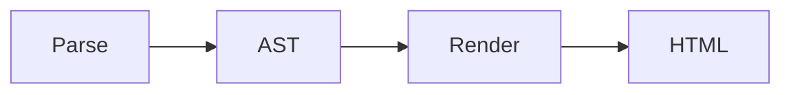

# Diagrams

Enable with `.UseDiagrams()` (included in `UseAdvancedExtensions()`).

When a fenced code block uses a recognized diagram language as its info string, Markdig renders it as a plain HTML block (without the nested `<code>` element) so client-side diagram libraries can consume the raw text easily.

By default:

- `mermaid` renders as a `<pre class="mermaid">...</pre>` block
- `nomnoml` renders as a `<div class="nomnoml">...</div>` block

## Supported languages

{.table}
| Language | Info string |
|---|---|
| [Mermaid](https://mermaid.js.org/) | `mermaid` |
| [nomnoml](https://github.com/skanaar/nomnoml) | `nomnoml` |

## Mermaid example

````markdown

````

This renders as:

```html
<pre class="mermaid">graph LR
    A[Parse] --> B[AST]
    B --> C[Render]
    C --> D[HTML]
</pre>
```

To display the diagram in a browser, include the Mermaid JavaScript library:

```html
<script src="https://cdn.jsdelivr.net/npm/mermaid/dist/mermaid.min.js"></script>
<script>mermaid.initialize({ startOnLoad: true });</script>
```

## nomnoml example

````markdown
```nomnoml
[Markdown] -> [Parser]
[Parser] -> [AST]
[AST] -> [Renderer]
[Renderer] -> [HTML]
```
````

## HTML output

Instead of the usual code block rendering:

```html
<pre><code class="language-mermaid">...</code></pre>
```

The diagrams extension produces a plain block for recognized languages, for example:

```html
<pre class="mermaid">...</pre>
<div class="nomnoml">...</div>
```

This allows client-side diagram libraries to find and render the content.
